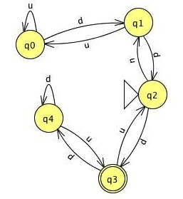
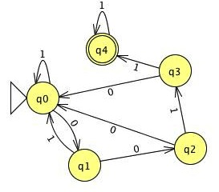
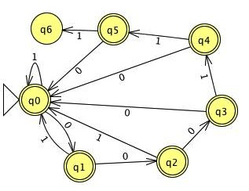
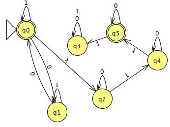
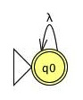
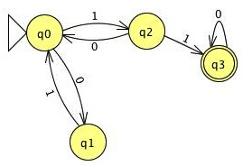
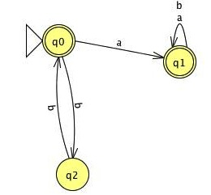
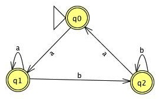

# Homework 1, Lucas Cycon, A10072750

## Problem 1

### Exercise 1.2 from Sipser

$M_1 = (\{q1, q1, q3\}, \{a,b\}, \delta, \{q1\}, \{q1, q2, q3\})$

where

$\delta$ =

         a    b
----     ---- -----
q1       q2   q1
q2       q3   q3
q3       q2   q1

$M_2 = (\{q1, q1, q3, q4\}, \{a,b\}, \delta, \{q1\}, \{q1, q2, q3, q4\})$

where

$\delta$ =

         a    b
----     ---- -----
q1       q1   q2
q2       q3   q4
q3       q2   q1
q4       q3   q4

### Exercise 1.3 from Sipser

See figure 1

## Problem 2

### Part a

The general plan here is to sit at the start node until we "begin" a valid
stream (see a 0).  We then continue eating input until we either get to the
final state where we no-op all input, or reset back to the input state.

Implmentation in figure 2

### Part b

Here, we follow a similar plan from Part a, in that we no-op until the
beginning of our bad sequence.  We consume input on this bad sequnece until the
last symbol.  Here, if it is a **1**, we move to the only non-final node. If it
is **0**, we go back to start.

Implementation in figure 3

### Part c

The strategy is to create two chains of input parsing. One to check valid zero
count, and another to check valid 1s count

Implmentation in figure 4

### Part d

Here, don't match anything put the empty string

Implementation in figure 5

## Problem 3

### Part a

For this task, we need repeating strings of "10" or "01".  The end of this
string must be terminated by "11" and then any even number of zeros.

Implemenetation in figure 6

\clearpage

## Problem 4

### Part a

**Def**: A DFA is a state maching = $(Q,\Sigma,\Gamma,\delta,s,F)$ while

- Q is a finite set of states
- $\Sigma$ is a finite set of input symbols
- $\Gamma$ is a finite set of output symbols
- $\delta: Q \times \Sigma \rightarrow (Q,\Gamma)$
- $s \in Q$
- $F \in Q$

### Part b

$T_1 = ({q1, q2}, {0, 1, 2}, {0, 1}, \delta, q1)$

where

$\delta$ = 

        0       1         2
-----   ------  -------   ---------
q1      q1,0    q1,0      q2,1
q2      q1,0    q2,1      q2,1

$T_2 = ({q1, q2, q3}, {a, b}, {0, 1}, \delta, q1)$

where

$\delta$ = 

        a       b     
-----   ------  ------
q1      q2,1    q3,1  
q2      q3,1    q1,0  
q3      q1,0    q2,1

## Problem 5

A strategy of build-test-fix-test was used to make/verify both of these.

### Part a

See figure 7

### Part b

See figure 8

