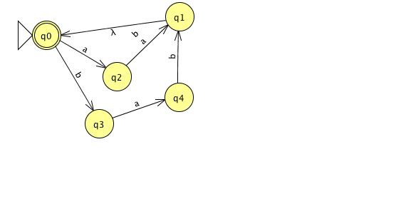
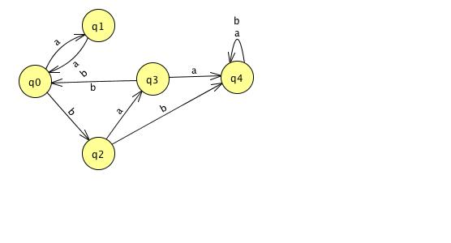

# Homework 2, Lucas Cycon, A10072750

## Problem 1

### Part A

Let $M = (Q,\Sigma,\delta,s,F)$ be a DFA that recognizes L.  There is a DFA
$M_1 = (Q_1,\Sigma,\delta_1,s_1,F_1)$ that recognizes the language $a \ L$ that
is defined as follows:

#. $Q_1 = Q$
#. $\delta_1 = \delta$
#. $s_1 = \delta(s, a)$
#. $F_1 = F$

### Part B

Let $M = (Q,\Sigma,\delta,s,F)$ be a DFA that recognizes L.  There is a DFA
that recognizes $z \ L$ as defined by $M_1 = (Q,\Sigma,\delta,s_1,F)$ where
$s_2 = \delta*(s,z)$ for any given input stream $z$

### Part C

Let $M = (Q,\Sigma,\delta,s,F)$ be a DFA that recognizes L.  There is a DFA
$M_1 = (Q, \Sigma, \delta_1, s_1, F)$ that recognizes $Z \ L$, where:

#. $s_1$ is a new start state
#. $\delta_1 = \delta$ plus the transitions to points reachable by reading a
   string Z from $s_1$
#. $\delta_1(s_1,\epsilon) = \{x \in S\}$

## Problem 2

### Part A

#### Part A

- Matching
    - $\epsilon$
    - aaabbb
- Non-matching
    - b
    - a

#### Part B

- Matching
    - ab
    - abab
- Non-matching
    - bab
    - b

#### Part C

- Matching
    - a
    - b
- Non-matching
    - ab
    - ba

#### Part D

- Matching
      - $\epsilon$
      - aaa
- Non-matching
      - aa
      - aaaa

#### Part E

- Matching
      - aba
      - aaba
- Non-matching
      - a
      - aa

#### Part F

- Matching
      - aba
      - bab
- Non-matching
      - aa
      - aaaa

#### Part G

- Matching
      - b
      - ab
- Non-matching
      - bb
      - aa

#### Part H

- Matching
    - a
    - ba
- Non-matching
    - b
    - ab

### Part B

#### Part 1

This matches a string starting and ending in 1.

    1(1 + 0)*1

#### Part 2

This matches all strings with at least a single 1 and a single 0.

    (0 + 1)*(10+ 01)(0 + 1)*

## Problem 3

### Part A

See figure 1.

### Part B

See figure 2.

## Problem 4

The regular expression:

    (<.*>)*

must hold for a valid file, where `.` represents any character except `>`
